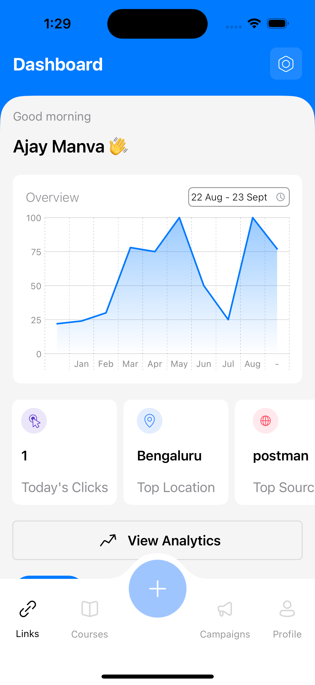
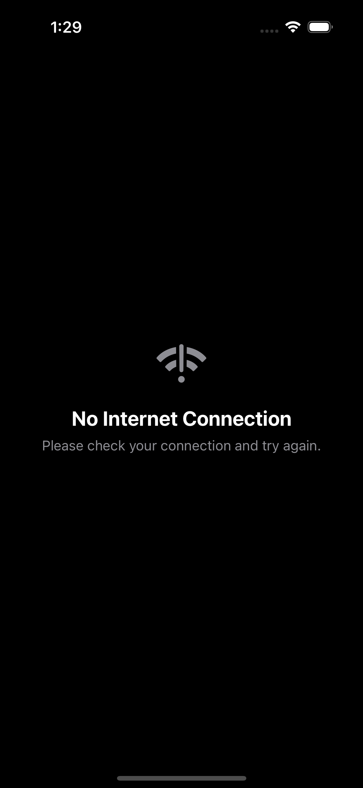
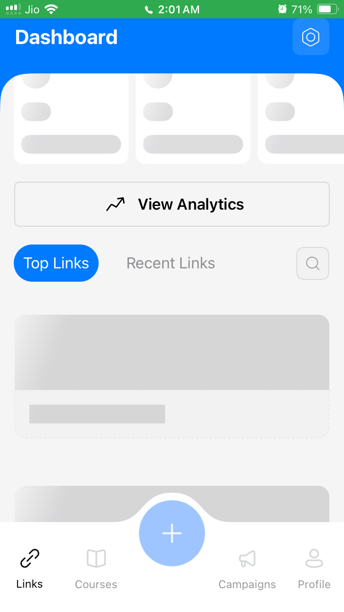
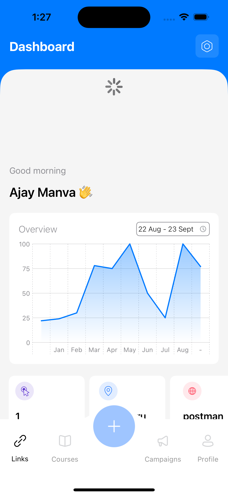
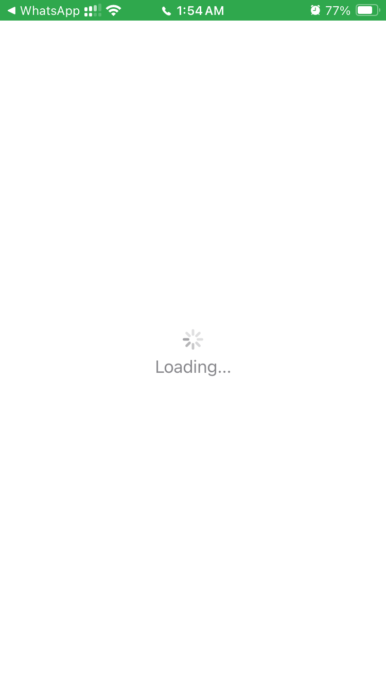
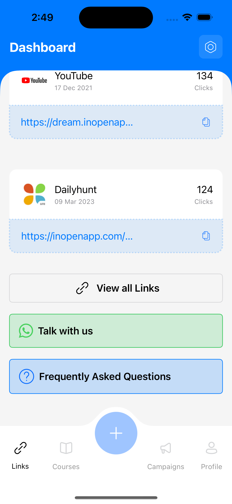
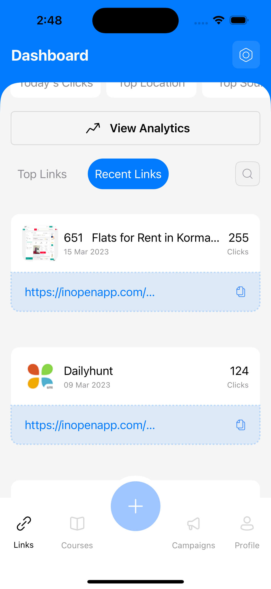
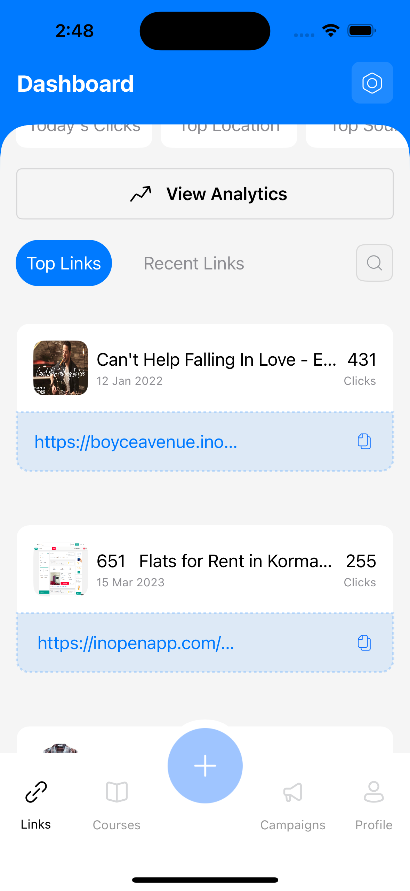

# OpeninApp-Assignment
### iOS Assignment 

## Technologies Used
- Language: Swift 📱
- Frameworks: SwiftUI(Primary), UIKit
- Architecture: MVVM 🏗️
- Target: iOS 17.0+ 🎯

## Features
- **Networking Connectivity** Checks 🌐
- Fetching Data using REST Apis 📡
- Fetching Images Async and **Caching them along 💸** 
- **Shimmer Loading Animations** ✨
- **Focued Search Field and Auto Scroll** 🔍
- **Drag down to reload** 🔄
- **Smooth Animations** 🚀
- Custom Shapes with **UIBezierPath** 🎨
- Opening Other Links and Applications 🌟

## Demo and Screenshots

<video width="320" height="240" controls>
	<source src="Recordings/video01.mp4" type="video/mp4">
</video>
  
<video width="320" height="240" controls>
	<source src="Recordings/video02.mp4" type="video/mp4">
</video>

